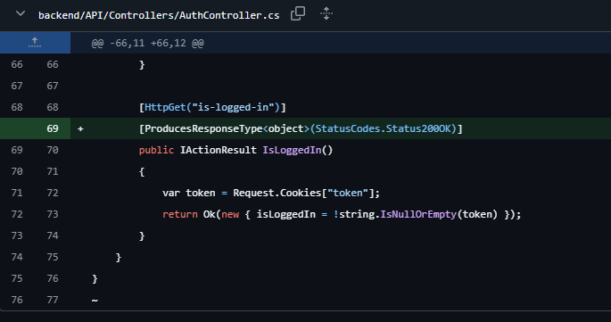

# Software quality:

## Used tools:

- SonarQube
- ESLint
- Dependabot

## Do you agree with the findings:

Not all, we deemed most of the issues not to be relevant. There were a lot of issues regarding the legacy python code, which we did not fix. We also ignored the duplicate code in the unit tests, since it is necessary to have the same code in multiple tests. Issues regarding the legacy code were ignored, because we were migrating to a new codebase.

## Which ones did you fix:

We were only focused on fixing issues regarding the new codebase. Our focus was on the high severity cases. We fixed the following issues:

### API endpoints not returning a response

- Issue: The API endpoints did not return a response when the request was successful.
- Solution: We added a response to the endpoints, so that the frontend can handle the response, and also to be complient with the OpenAPI/Swagger documentation.

## Which ones did you ignore:

- We also ignored the JWT_KEY issue, as we deemed it to be a false positive. The key is stored in a .env file, which is not included in the repository.
- Duplicate code in unit tests
- Issues regarding the legacy python code.
  - Security issues.
  - Code smells.
  - Vulnerabilities.

## Planning to fix

Because of time constraints, we were not able to fix all the issues. We plan to fix the following issues in the future:

- Some rerendering issues for the frontend, causing unnecessary rerendering. We plan to fix this issue by wrapping the component in `useMemo`.
- Minor issues regarding naming conventions.
- Insecure configuration for the JWT cookie (marked as low), where the secure property is set to false. This is because we were using HTTP before, and since we are now using HTTPS, we can set the secure property to true.
