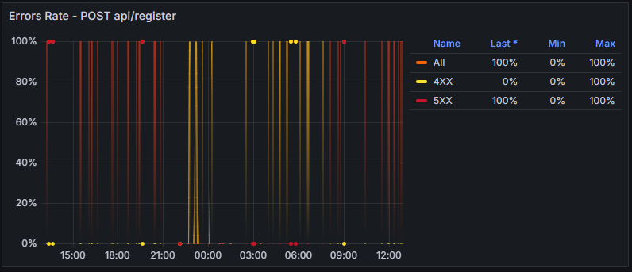
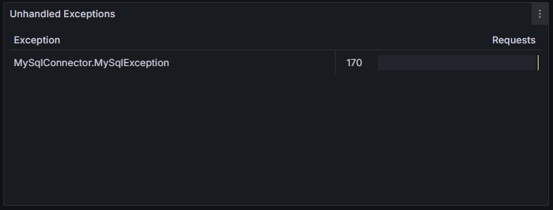

# Monitoring realization

## Monitoring stack

- We use Grafana for visualization.
- We use Prometheus for data collection.
- We use Node Exporter for collecting system metrics.

### Monitoring implementation

- We have a seperate Prometheus server running on the same instance as the Grafana server.
- We have only implmented the monitoring for the frontend+backend service excluding the db service.

## Issue discovery

We discovered an issue with our application. Every request fails with status code 500.

Our monitoring suggests that there is an issue with the connection to the database.

By further investigation, we found that the docker container running the database, was trying to restart, but failed with status code 137, ie. the allocated memory was not enough.

## Issue resolution

- We restarted the server and the database container.
- As a temporary solution, we increased the swap memory.
- We planned a migration to an instance with more memory (Azures B2s instance).
